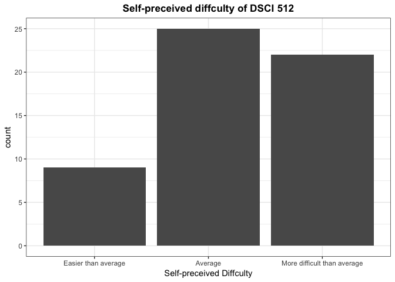
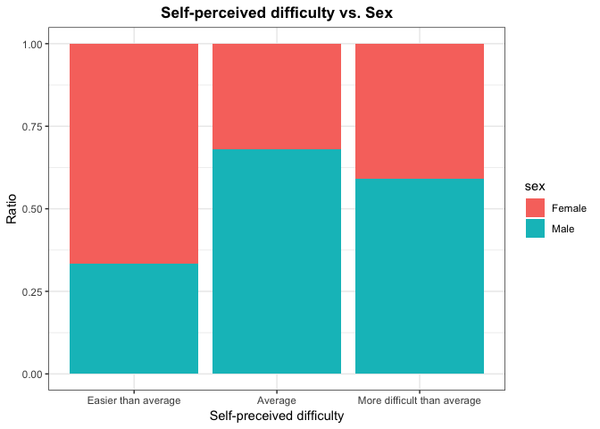
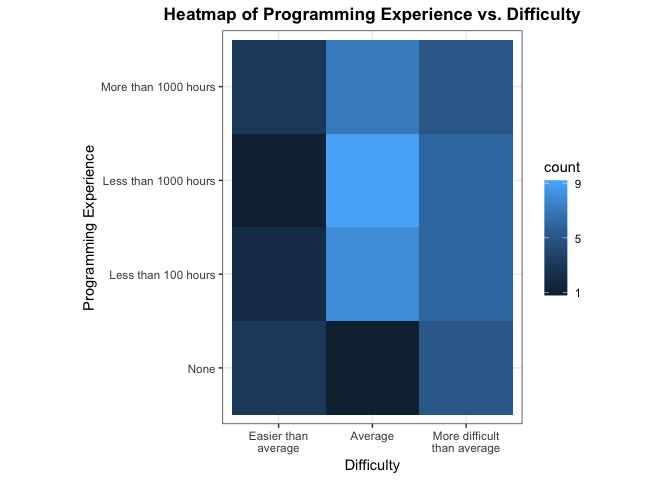

Milestone 2 - EDA
================
Author: Patrick Tung, PAUL VIAL and Mengda (Albert) Yu
 2019-04-12

1.0 Data Wrangling
==================

In this milestone, we collected 56 observations from other MDS students, 554 TAs and lab instructor. Each observation contains five variables, including the followings in the table.

| Variable       | Name                                              | Type     |
|----------------|---------------------------------------------------|----------|
| Confounder     | Sex                                               | category |
| Confounder     | Math Skills                                       | ordinal  |
| Confounder     | Friends who have jobs associated with programming | category |
| Main Covariate | Previous programming experience                   | ordinal  |
| Outcome        | Self-perceived difficulty                         | ordinal  |

``` r
# Read data
data <- suppressMessages(read_csv("./data/data.csv", skip = 2))

# Select data 
data <-  
  data %>% 
  select(18:22)

# Rename columns 
names(data) <- c("sex", "math_skill", "friend_with_prog", "prog_exp", "difficulty")

# factorize variable in the data
clean_data <- 
  data %>%
  mutate(sex = as_factor(sex),
         math_skill = factor(math_skill,
                                levels=c("Below Average",
                                         "Average",
                                         "Above Average"), ordered=TRUE),
         friend_with_prog = as_factor(friend_with_prog),
         prog_exp = factor(prog_exp,
                              levels=c("None",
                                       "Less than 100 hours",
                                       "Less than 1000 hours",
                                       "More than 1000 hours"), ordered=TRUE),
         difficulty = factor(difficulty,
                                levels=c("Easier than average",
                                         "Average",
                                         "More difficult than average"),
                                ordered=TRUE)
  )
```

``` r
# Get the size of the data
dim(clean_data)
```

    ## [1] 56  5

``` r
# Get the strcture of the data
str(clean_data)
```

    ## Classes 'tbl_df', 'tbl' and 'data.frame':    56 obs. of  5 variables:
    ##  $ sex             : Factor w/ 2 levels "Female","Male": 1 1 2 1 2 2 1 2 2 2 ...
    ##  $ math_skill      : Ord.factor w/ 3 levels "Below Average"<..: 3 3 3 3 3 2 2 3 3 3 ...
    ##  $ friend_with_prog: Factor w/ 2 levels "Yes","No": 1 1 1 2 1 2 1 2 1 2 ...
    ##  $ prog_exp        : Ord.factor w/ 4 levels "None"<"Less than 100 hours"<..: 1 3 2 2 3 3 4 2 4 2 ...
    ##  $ difficulty      : Ord.factor w/ 3 levels "Easier than average"<..: 1 2 2 2 3 3 1 2 2 2 ...

``` r
# cross classication counts for difficulty by sex 
kable(table(clean_data$difficulty, clean_data$sex))
```

|                             |  Female|  Male|
|-----------------------------|-------:|-----:|
| Easier than average         |       6|     3|
| Average                     |       8|    17|
| More difficult than average |       9|    13|

``` r
# cross classication counts for difficulty by math_skill 
kable(table(clean_data$difficulty, clean_data$math_skill))
```

|                             |  Below Average|  Average|  Above Average|
|-----------------------------|--------------:|--------:|--------------:|
| Easier than average         |              1|        5|              3|
| Average                     |              1|        3|             21|
| More difficult than average |              1|        6|             15|

``` r
# cross classication counts for difficulty by friend_with_prog 
kable(table(clean_data$difficulty, clean_data$friend_with_prog))
```

|                             |  Yes|   No|
|-----------------------------|----:|----:|
| Easier than average         |    6|    3|
| Average                     |   21|    4|
| More difficult than average |   13|    9|

``` r
# cross classication counts for difficulty by prog_exp 
kable(table(clean_data$difficulty, clean_data$prog_exp))
```

|                             |  None|  Less than 100 hours|  Less than 1000 hours|  More than 1000 hours|
|-----------------------------|-----:|--------------------:|---------------------:|---------------------:|
| Easier than average         |     3|                    2|                     1|                     3|
| Average                     |     1|                    8|                     9|                     7|
| More difficult than average |     5|                    6|                     6|                     5|

2.0 EDA
=======

2.1 Self-Perceived Difficulty
-----------------------------

``` r
clean_data %>%
  ggplot() + 
  theme_bw() +
  labs(x = "Self-preceived Diffculty",
    # y = "y",
    title = "Self-preceived diffculty of DSCI 512") +
  theme(plot.title = element_text(size = 13, face = "bold", hjust = 0.5)) + 
  geom_bar(aes(difficulty)) 
```



Looking at the overall distribtion of the "self-perceived difficulty" of DSCI, we can see that most people generally though the course was quite difficult.

2.2 - Programming Experience Prior to the Program
-------------------------------------------------

``` r
clean_data %>%
  ggplot() + 
  theme_bw() +
  labs(x = "Programming experience prior to the program",
    # y = "y",
    title = "Level of programming experience prior to the program") +
  theme(plot.title = element_text(size = 13, face = "bold", hjust = 0.5)) + 
  geom_bar(aes(prog_exp)) 
```


This figure is quite interesting because we saw a pretty consistent number of people across each category. It is also a little weird to see that there are nearly 10 people who have no programming experience prior to the program because, as a group, we thought that programming experience was a requirement for the program.

2.3 - Self-Perceived Difficulty by Sex
--------------------------------------

``` r
clean_data %>%
  ggplot() +
  theme_bw() +
  labs(x = "Self-preceived difficulty",
    y = "Ratio",
    title = "Self-perceived difficulty vs. Sex") +
  theme(plot.title = element_text(size = 13, face = "bold", hjust = 0.5)) +
  geom_bar(aes(x = difficulty, fill=sex), position = "fill")
```



The self-reported difficulty that most of male students felt is average. The number of female students who felt the course easy is actually greater than the number of male student who had the same feeling.

2.4 - Heatmap of Programming Experience vs. Difficulty
------------------------------------------------------

``` r
clean_data %>% ggplot(aes(prog_exp, difficulty)) +
  geom_bin2d() +
  theme_bw() +
  labs(y = "Self-perceived ifficulty",
       x = "Programming Experience",
       title = "Heatmap of Programming Experience vs. Difficulty") +
  theme(plot.title = element_text(size = 13, face = "bold", hjust = 0.5)) +
  coord_fixed() +
  scale_x_discrete(
    labels = function(difficulty)
      str_wrap(difficulty, width = 14)
  ) +
  scale_fill_continuous(breaks = c(1, 5, 9))
```



It can be seen that the number of students who have been experiencing a harder time in DSCI 512 is greater than the number of students who felt that is was easier than average.

2.5 - Self-perceived difficulty vs. friend with programming experience
----------------------------------------------------------------------


It is interesting to note that the students who have no friends with programming experience are more likely to feel more difficult with the course materials. If a student has friends with programming experience, he/she tends to think that the difficulty of the course is average.

Conclusion
==========

Our data seemed to be very balanced overall, with people in all categories. Unfortunately, because our data is strictly only categorical, we did not have much to work with. Perhaps it would have been a little easier to see relationships if our self-perceived difficulty were numerical and continuous. However, there is still a lot of analysis that needs to be done in order to make any concrete judgements.
