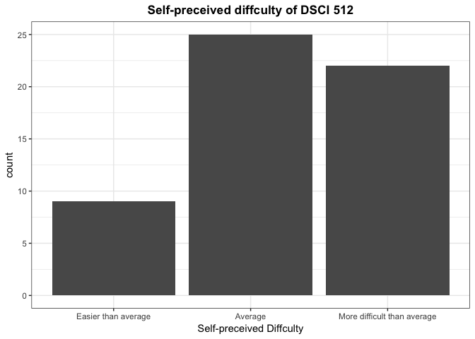
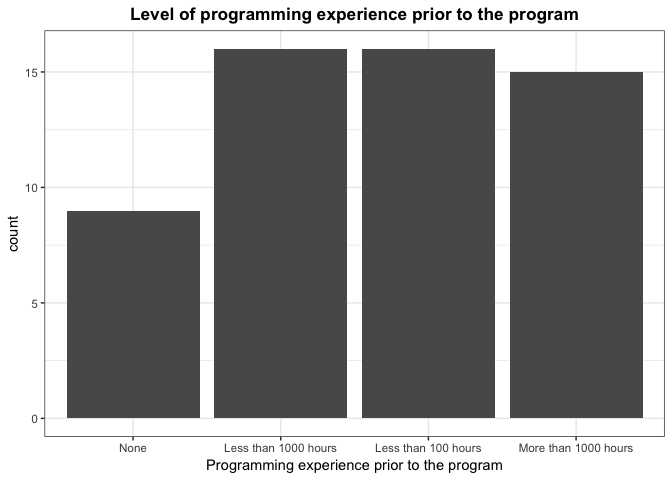

Milestone 2 - EDA
================
Author: Patrick Tung, PAUL VIAL and Mengda (Albert) Yu
 2019-04-04

1.0 Clean data
==============

In this milestone, we collected 56 observations from other MDS students, 554 TAs and lab instructor. Each observation contains five variables, including the followings in the table.

| Variable       | Name                                              | Type     |
|----------------|---------------------------------------------------|----------|
| Confounder     | Sex                                               | category |
| Confounder     | Math Skills                                       | ordinal  |
| Confounder     | Friends who have jobs associated with programming | category |
| Main Covariate | Previous programming experience                   | ordinal  |
| Outcome        | Self-perceived difficulty                         | ordinal  |

``` r
# Read data
data <- suppressMessages(read_csv("./data/data.csv", skip = 2))

# Select data 
data <-  
  data %>% 
  select(18:22)

# Rename columns 
names(data) <- c("sex", "math_skill", "friend_with_prog", "prog_exp", "difficulty")

# factorize variable in the data
clean_data <- 
  data %>%
  mutate(sex = as_factor(sex),
         math_skill = as_factor(math_skill,
                                levels=c("Below Average",
                                         "Average",
                                         "Above Average"), ordered=TRUE),
         friend_with_prog = as_factor(friend_with_prog),
         prog_exp = as_factor(prog_exp,
                              levels=c("None",
                                       "Less than 100 hours",
                                       "Less than 1000 hours",
                                       "More than 1000 hours"), ordered=TRUE),
         difficulty = as_factor(difficulty,
                                levels=c("Easier than average",
                                         "Average",
                                         "More difficult than average"),
                                ordered=TRUE)
  )

# Get the size of the data
dim(clean_data)
```

    ## [1] 56  5

``` r
# Get the strcture of the data
str(clean_data)
```

    ## Classes 'tbl_df', 'tbl' and 'data.frame':    56 obs. of  5 variables:
    ##  $ sex             : Factor w/ 2 levels "Female","Male": 1 1 2 1 2 2 1 2 2 2 ...
    ##  $ math_skill      : Factor w/ 3 levels "Above Average",..: 1 1 1 1 1 2 2 1 1 1 ...
    ##  $ friend_with_prog: Factor w/ 2 levels "Yes","No": 1 1 1 2 1 2 1 2 1 2 ...
    ##  $ prog_exp        : Factor w/ 4 levels "None","Less than 1000 hours",..: 1 2 3 3 2 2 4 3 4 3 ...
    ##  $ difficulty      : Factor w/ 3 levels "Easier than average",..: 1 2 2 2 3 3 1 2 2 2 ...

2.0 EDA
=======

2.1 EDA-1
---------

``` r
clean_data %>%
  ggplot() + 
  theme_bw() +
  labs(x = "Self-preceived Diffculty",
    # y = "y",
    title = "Self-preceived diffculty of DSCI 512") +
  theme(plot.title = element_text(size = 13, face = "bold", hjust = 0.5)) + 
  geom_bar(aes(difficulty)) 
```



2.1 EDA-2
---------

``` r
clean_data %>%
  ggplot() + 
  theme_bw() +
  labs(x = "Programming experience prior to the program",
    # y = "y",
    title = "Level of programming experience prior to the program") +
  theme(plot.title = element_text(size = 13, face = "bold", hjust = 0.5)) + 
  geom_bar(aes(prog_exp)) 
```



2.1 EDA-3
---------

``` r
clean_data %>%
  ggplot() + 
  theme_bw() +
  labs(x = "Self-preceived difficulty",
    # y = "y",
    title = "Self-perceived difficulty vs. Sex") +
  theme(plot.title = element_text(size = 13, face = "bold", hjust = 0.5)) + 
  geom_bar(aes(x = difficulty, fill = sex), position = "dodge") 
```


2.1 EDA-4
---------

``` r
clean_data %>% ggplot(aes(difficulty, prog_exp)) +
  geom_bin2d() +
  theme_bw() +
  labs(x = "Difficulty", y = "Programming Experience",
       title = "Heatmap of Programming Experience vs. Difficulty") +
  theme(plot.title = element_text(size = 13, face = "bold", hjust = 0.5)) +
  coord_fixed() +
  scale_x_discrete(
    labels = function(difficulty)
      str_wrap(difficulty, width = 14)
  ) +
  scale_fill_continuous(breaks = c(1, 5, 9))
```


