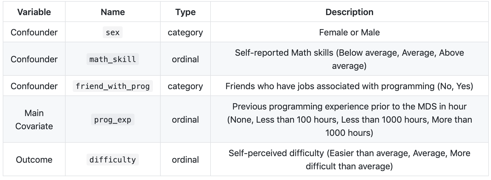
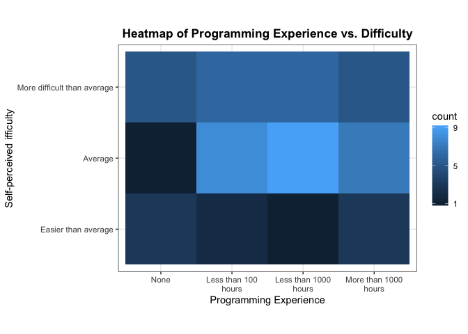
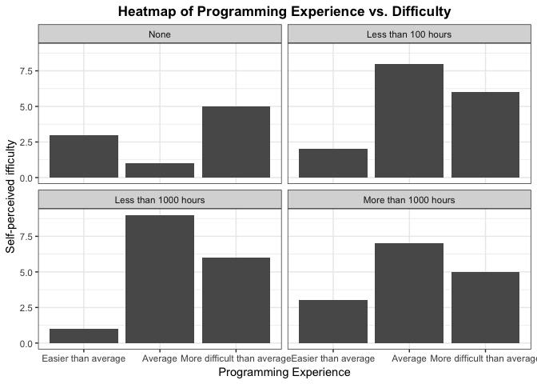
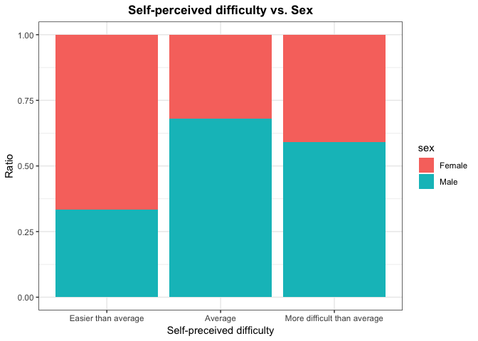
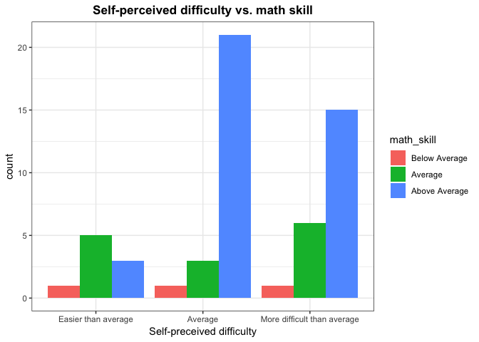
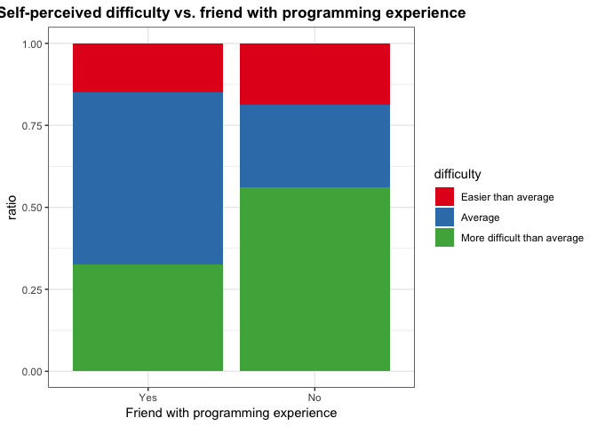

Milestone 3 - Report
================
Authors: Patrick Tung, Paul Vial, and Mengda (Albert) Yu
Date: 2019/04/12

-   [1.0 Introduction](#introduction)
-   [2.0 Data description](#data-description)
-   [3.0 Key EDA](#key-eda)
-   [4.0 Analysis](#analysis)
    -   [4.1 Method 1 - Ordinal Logistic Regression Test](#method-1---ordinal-logistic-regression-test)
    -   [4.2 Method 2 - Likelihood Ratio Test with Ordinal Logistic Regression](#method-2---likelihood-ratio-test-with-ordinal-logistic-regression)
-   [5.0 Discussion](#discussion)
    -   [5.1 Findings](#findings)
    -   [5.2 Survey design](#survey-design)
-   [6.0 References](#references)

------------------------------------------------------------------------

1.0 Introduction
================

As the Master of Data science program is soon to end, we all like to reflect on the courses we have taken. Some courses we took were difficult and some were relatively easy, but the true question is, how was this affected by our prior experience. DSCI 512 is a programming and algorithms course in the MDS program at UBC which introduces fundamental algorithms such as sorting and searching, as well as data structures. This project is to analyze whether the level of programming experience prior to the MDS program affects an MDS student's self-perceived difficulty of DSCI 512 materials.

Question: Does their level of programming experience prior to the MDS program influence a person's self-perceived difficulty of DSCI 512 (Algorithms and Data Structures)?

We began with defining a null hypothesis and alternative hypothesis, as shown below.

> **Null hypothesis:** The level of programming experience prior to the MDS program does not influence a person's self-perceived difficulty regarding DSCI 512.

> **Alternative hypothesis:** The level of programming experience prior to the MDS program influences a person's self-perceived difficulty regarding DSCI 512.

After extensive brainstorming, we decided that the variables we believe that are important are:

-   Previous programming experience
-   Sex
-   Mathematics skill level
-   Whether or not a student has friends or family with programming experience

2.0 Data description
====================

To gather the [data](https://github.ubc.ca/MDS-2018-19/DSCI_554_Project_data/blob/master/data.csv), we created a survey and collected 56 observations from our fellow MDS students, DSCI 554 TAs, and lab instructor for self-perceived difficulty of the DSCI 512 course.



*Table 1: Surveyed Variables*

|                             |     Female|       Male|
|-----------------------------|----------:|----------:|
| Easier than average         |  0.1071429|  0.0535714|
| Average                     |  0.1428571|  0.3035714|
| More difficult than average |  0.1607143|  0.2321429|

*Table 2: Cross classication proportions for difficulty by sex*

|                             |  Below Average|    Average|  Above Average|
|-----------------------------|--------------:|----------:|--------------:|
| Easier than average         |      0.0178571|  0.0892857|      0.0535714|
| Average                     |      0.0178571|  0.0535714|      0.3750000|
| More difficult than average |      0.0178571|  0.1071429|      0.2678571|

*Table 3: Cross classication proportions for difficulty by math skills*

|                             |        Yes|         No|
|-----------------------------|----------:|----------:|
| Easier than average         |  0.1071429|  0.0535714|
| Average                     |  0.3750000|  0.0714286|
| More difficult than average |  0.2321429|  0.1607143|

*Table 4: Cross classication proportions for difficulty by friends or family with programming experience*

|                             |       None|  Less than 100 hours|  Less than 1000 hours|  More than 1000 hours|
|-----------------------------|----------:|--------------------:|---------------------:|---------------------:|
| Easier than average         |  0.0535714|            0.0357143|             0.0178571|             0.0535714|
| Average                     |  0.0178571|            0.1428571|             0.1607143|             0.1250000|
| More difficult than average |  0.0892857|            0.1071429|             0.1071429|             0.0892857|

*Table 5: Cross classication proportions for difficulty by programming experience*

3.0 Key EDA
===========

First, we did some preliminary investigations to understand the data and discover important patterns.



<p style="text-align:center;">
Figure 1.
</p>
It can be seen that the number of students who have been experiencing a harder time in DSCI 512 is greater than the number of students who found the course easier than average.



<p style="text-align:center;">
Figure 2.
</p>
The group without programming experience had the greatest proportion of people that found the course to be difficult. It makes sense that if students have no programming experiences, they are more likely to struggle with assignments and tests. It is also interesting that the most commonly reported level of difficulty was "Average" across the three other groups (less than 100, less than 1000 hours, More than 1000 hours), and that relatively few students found the course to be more difficult or less difficult than average.



<p style="text-align:center;">
Figure 3.
</p>
Most male students reported average difficulty. The number of female students who felt the course was easy is greater than the number of male students who felt that way.



<p style="text-align:center;">
Figure 4.
</p>
In this figure, we observe that the most of students who have proficiency in math felt that the difficulty of DSCI 512 is average. It seems that the math skill does not affect the self-perceived difficulty of the course.



<p style="text-align:center;">
Figure 5.
</p>
It is interesting to note that the students who have no friends or family with programming experience are more likely to feel more difficult with the course materials. If a student has friends with programming experience, he/she tends to think that the difficulty of the course is average.

4.0 Analysis
============

To analyze our data, we implemented two different methods of testing: (1) Ordinal Logistic Regression Test and (2) Likelihood Ratio Test with multiple Ordinal Regression Models.

4.1 Method 1 - Ordinal Logistic Regression Test
-----------------------------------------------

We decided to apply ordinal regression to test whether the main exposure `prog_exp` with some confounders have a significant impact on our outcome `difficulty`. The orginal regression is used to facilitate the interaction of dependent variables (having multiple ordered levels) with one or more independent variables. We used the polr from `MASS` package to estimate the OLR model. We also had `Hess = TRUE` to return the observed information matrix from optimaization for standard error.

``` r
# fit ordered logit regression model 
m <- polr(difficulty~ prog_exp + sex+math_skill + friend_with_prog, data=clean_data, Hess=TRUE)
# view a summary of the model 
summary(m)
```

    ## Call:
    ## polr(formula = difficulty ~ prog_exp + sex + math_skill + friend_with_prog, 
    ##     data = clean_data, Hess = TRUE)
    ## 
    ## Coefficients:
    ##                                 Value Std. Error  t value
    ## prog_expLess than 100 hours  -0.17284     0.8932 -0.19350
    ## prog_expLess than 1000 hours  0.03418     0.9174  0.03726
    ## prog_expMore than 1000 hours -0.16640     0.9370 -0.17759
    ## sexMale                       0.33583     0.5400  0.62194
    ## math_skillAverage             0.33076     1.3670  0.24197
    ## math_skillAbove Average       0.88570     1.2939  0.68450
    ## friend_with_progNo            0.77935     0.6380  1.22162
    ## 
    ## Intercepts:
    ##                                     Value   Std. Error t value
    ## Easier than average|Average         -0.6713  1.5074    -0.4453
    ## Average|More difficult than average  1.5127  1.5184     0.9963
    ## 
    ## Residual Deviance: 111.0194 
    ## AIC: 129.0194

The output of coefficents table contains the values of each coefficients, standard error and t values. Residual deviance and AIC are useful for later model comparison.

We calculated the p-values by comparing the t-value against the standard normal distribution and assumed that our data set is large enough.

``` r
# create table
ctable <- coef(summary(m))
# calculate p-values
p <- pnorm(abs(ctable[, "t value"]), lower.tail = FALSE) * 2
ctable <- cbind(ctable, "p value" = p)
ctable %>% kable()
```

|                                     |       Value|  Std. Error|     t value|    p value|
|-------------------------------------|-----------:|-----------:|-----------:|----------:|
| prog\_expLess than 100 hours        |  -0.1728359|   0.8931988|  -0.1935021|  0.8465657|
| prog\_expLess than 1000 hours       |   0.0341831|   0.9173926|   0.0372611|  0.9702768|
| prog\_expMore than 1000 hours       |  -0.1663964|   0.9369797|  -0.1775880|  0.8590465|
| sexMale                             |   0.3358303|   0.5399724|   0.6219398|  0.5339814|
| math\_skillAverage                  |   0.3307642|   1.3669667|   0.2419695|  0.8088038|
| math\_skillAbove Average            |   0.8856973|   1.2939238|   0.6845050|  0.4936563|
| friend\_with\_progNo                |   0.7793453|   0.6379616|   1.2216178|  0.2218522|
| Easier than average|Average         |  -0.6713122|   1.5074144|  -0.4453401|  0.6560740|
| Average|More difficult than average |   1.5127481|   1.5184046|   0.9962747|  0.3191167|

*Table 6. P-value of coefficients and intercepts*

We can observe from table 6 that all p-values are greater than a typical threshold 0.05, which indicates that a significant difference exists. In other words, the different level of programming experience prior to the MDS program does not affect the MDS students' self-perceived difficulty of DSCI 512.

We also applied [Anova type 3](https://mcfromnz.wordpress.com/2011/03/02/anova-type-iiiiii-ss-explained/) from `Car` R package that can be used in [ordinal regression model](https://rpubs.com/kaz_yos/polr) to verify the results above.

``` r
# perform Anova type 3 test on the ordinal regression model 
Anova(m, type = 3)
```

    ## Analysis of Deviance Table (Type III tests)
    ## 
    ## Response: difficulty
    ##                  LR Chisq Df Pr(>Chisq)
    ## prog_exp          0.14187  3     0.9864
    ## sex               0.38773  1     0.5335
    ## math_skill        1.09944  2     0.5771
    ## friend_with_prog  1.51981  1     0.2176

As shown above, it can be clearly seen that the results suggest that neither one of variables has a significant impact on the outcome variable `difficulty`.

4.2 Method 2 - Likelihood Ratio Test with Ordinal Logistic Regression
---------------------------------------------------------------------

Here we compared the fit of several different models. We have forgone any multiple comparison corrections due to the high p-values resulting from **all** of the models below. If any of these models had p-values less than 0.05, we would have controlled the family-wise error rate via a Bonferroni correction.

First, we compared the null model to the model from Method 1 above:

``` r
# Null model, no predictors
olr.M0 <- polr(difficulty~1, data=clean_data)   
```

``` r
# Full model (additive)
olr.M1 <- polr(difficulty~sex+math_skill+friend_with_prog+prog_exp, data=clean_data)
```

``` r
#Are all variables good predictors?
lrtest(olr.M1, olr.M0)
```

    ## Likelihood ratio test
    ## 
    ## Model 1: difficulty ~ sex + math_skill + friend_with_prog + prog_exp
    ## Model 2: difficulty ~ 1
    ##   #Df LogLik Df  Chisq Pr(>Chisq)
    ## 1   9 -55.51                     
    ## 2   2 -57.17 -7 3.3203     0.8539

Based on the p-value, this model does not provide a better fit than the null model. Next, we try a model using only our main independent variable, `prog_exp`:

``` r
# Reduced model, with our main variable
olr.M2 <- polr(difficulty~prog_exp, data=clean_data)
```

``` r
# How does the model without any confounding variables perform?
lrtest(olr.M2, olr.M0)
```

    ## Likelihood ratio test
    ## 
    ## Model 1: difficulty ~ prog_exp
    ## Model 2: difficulty ~ 1
    ##   #Df  LogLik Df  Chisq Pr(>Chisq)
    ## 1   5 -56.951                     
    ## 2   2 -57.170 -3 0.4385     0.9322

This model provides an even worse fit compared to the null model.

Lastly, we try modelling an interaction between `friend_with_prog`, and `prog_exp`. The rationale here is that the effect of having a friend or family member with programming experience may vary based on personal programming experience. For example, a student with more than 1000 hours of programming experience may not benefit from having a friend or family member with programming experience because they already have the programming that the friend or family member might otherwise help them with. On the other hand, a student with no programming experience probably stands to benefit far more if they have a friend or family member who can help them with coding.

``` r
# Modeling a possible interaction
olr.M3 <- polr(difficulty~friend_with_prog*prog_exp, data=clean_data)
```

``` r
# How does the interaction model perform?
lrtest(olr.M3, olr.M0)
```

    ## Likelihood ratio test
    ## 
    ## Model 1: difficulty ~ friend_with_prog * prog_exp
    ## Model 2: difficulty ~ 1
    ##   #Df  LogLik Df  Chisq Pr(>Chisq)
    ## 1   9 -53.868                     
    ## 2   2 -57.170 -7 6.6033     0.4713

Again, this does not yeild a better fit than the null model.

``` r
# TBD: Shoud we try this?
olr.M4 <- polr(difficulty~sex+math_skill+friend_with_prog*prog_exp, data=clean_data)
```

``` r
#Are all variables good predictors?
lrtest(olr.M4, olr.M0)
```

    ## Likelihood ratio test
    ## 
    ## Model 1: difficulty ~ sex + math_skill + friend_with_prog * prog_exp
    ## Model 2: difficulty ~ 1
    ##   #Df  LogLik  Df  Chisq Pr(>Chisq)
    ## 1  12 -52.056                      
    ## 2   2 -57.170 -10 10.227     0.4208

5.0 Discussion
==============

5.1 Findings
------------

1.  Discussing the results and findings of your survey and analysis of the survey data.

5.2 Survey design
-----------------

Discussing your survey/study design, specifically:

1.  what did you do well to make this study as causal as possible?

We put a lot of thought into which variables to include as potential confounders. Spending the proper amount of time on this before distributing the survey helped ensure that we did not realize additional potential confounders during our analysis when it would be too late to gather data to control for them. This diligence helped our end goal of reaching a conclusion free of spurious findings.

1.  what was not done well and how did that effect your studies conclusions?

One of the biggest problems that we discovered after performing the analysis is that the amount of data we collected is simply not enough to make conclusive claims. Perhaps it would have been helpful if we decided to collect data from previous cohorts of the MDS program. It might also be better if we continued our research to allow future MDS cohorts to reflect and take the survey.

Another issue of our survey is that the level of "self-reported" information is very subjective. An "Average" difficulty might mean something different to two different students. Therefore, it is quite difficult to evaluate the results of our research.

1.  what would you do differently next time to improve your survey/study design and why?

Originally when we were designing our survey, we thought it was very logical to make our variables categorical and ordinal, even our response variable (i.e. self-perceived difficulty of DSCI 512). However, while we were performing analyses and tests with our data, we realized that because our variables were not numerical, we lost a lot of flexibility with our analysis. If, for example, our response variable was numerical, we could have performed more tests such as ANOVA. Furthermore, if we found that numerical data does not work with our analysis, we could have binned them to become categorical. We feel that only using categorical data limited our ability to perform different analysis, and if we were to perform similar research in the future, this is definitely something we would change.

6.0 References
==============

1.  [How to use Multinomial and Ordinal Logistic Regression in R ?](https://www.analyticsvidhya.com/blog/2016/02/multinomial-ordinal-logistic-regression/)
2.  [Ordinal logistic regression](https://stats.idre.ucla.edu/r/dae/ordinal-logistic-regression/)

------------------------------------------------------------------------

-   Your target audience is other Data Scientists who are not familiar with your project.
-   Clearly introduce the survey topic and question you were interested in answering.
-   Link to your study's data and code in the methods section of your report.
-   Include effective visualizations and/or tables that help communicate your findings.
-   Your discussion should have 2 key focuses:

1.  Discussing the results and findings of your survey and analysis of the survey data.
2.  Discussing your survey/study design, specifically:
    -   what did you do well to make this study as causal as possible?
    -   what was not done well and how did that effect your studies conclusions?
    -   what would you do differently next time to improve your survey/study design and why?
