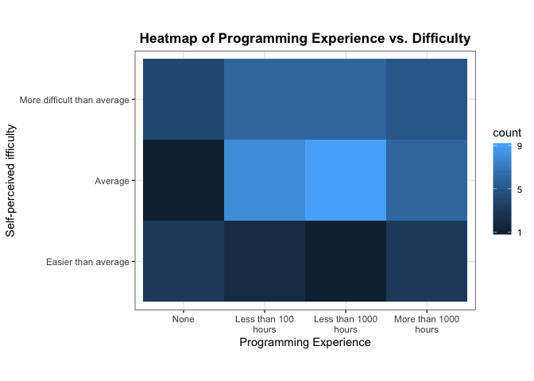
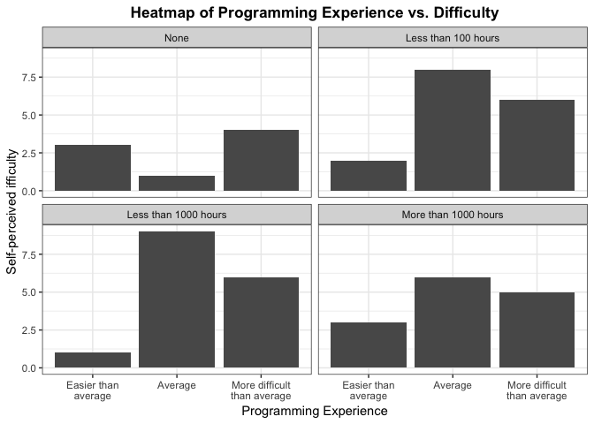
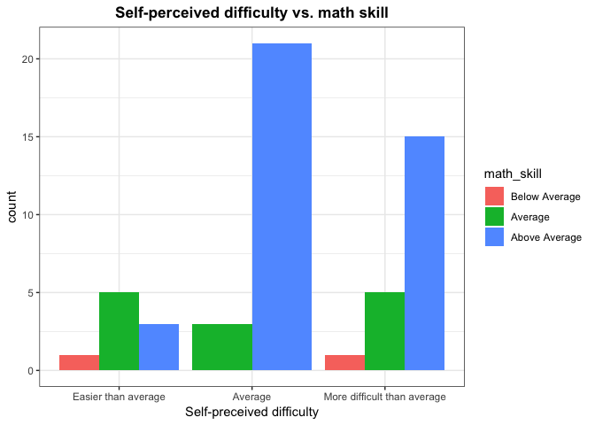

Milestone 3 - Report
================
Authors: Patrick Tung, Paul Vial, and Mengda (Albert) Yu
Date: 2019/04/22

# 1.0 Introduction

As the Master of Data science program is soon to end, we all like to
reflect on the courses we have taken. Some courses we took were
difficult and some were relatively easy, but the true question is, how
was this affected by our prior experience. DSCI 512 is a programming and
algorithms course in the MDS program at UBC which introduces fundamental
algorithms such as sorting and searching, as well as data structures.
This project is to analyze whether the level of programming experience
prior to the MDS program affects an MDS student’s self-perceived
difficulty of DSCI 512 materials.

Question: Does their level of programming experience prior to the MDS
program influence a person’s self-perceived difficulty of DSCI 512
(Algorithms and Data Structures)?

We began with defining a null hypothesis and alternative hypothesis, as
shown below.

> **Null hypothesis:** The level of programming experience prior to the
> MDS program does not influence a person’s self-perceived difficulty
> regarding DSCI 512.

> **Alternative hypothesis:** The level of programming experience prior
> to the MDS program influences a person’s self-perceived difficulty
> regarding DSCI 512.

After extensive brainstorming, we decided that the variables we believe
that are important are:

  - Previous programming experience
  - Sex
  - Mathematics skill level
  - Whether or not a student has friends or family with programming
    experience

# 2.0 Data description

To gather the data, we created a survey and collected 56 observations
from our fellow MDS students, DSCI 554 TAs, and lab instructor for
self-perceived difficulty of the DSCI 512
course.

|    Variable    |        Name        |    Type     |                                                           Description                                                            |
| :------------: | :----------------: | :---------: | :------------------------------------------------------------------------------------------------------------------------------: |
|   Confounder   |       `sex`        | categorical |                                                          Female or Male                                                          |
|   Confounder   |    `math_skill`    | categorical |                                Self-reported Math skills (Below average, Average, Above average)                                 |
|   Confounder   | `friend_with_prog` |  category   |                                   Friends who have jobs associated with programming (No, Yes)                                    |
| Main Covariate |     `prog_exp`     | categorical | Previous programming experience prior to the MDS in hour (None, Less than 100 hours, Less than 1000 hours, More than 1000 hours) |
|    Outcome     |    `difficulty`    |   ordinal   |                      Self-perceived difficulty (Easier than average, Average, More difficult than average)                       |

*Table 1: Surveyed Variables*

|                             |    Female |      Male |
| --------------------------- | --------: | --------: |
| Easier than average         | 0.1111111 | 0.0555556 |
| Average                     | 0.1296296 | 0.3148148 |
| More difficult than average | 0.1481481 | 0.2407407 |

*Table 2: Cross classication proportions for difficulty by
sex*

|                             | Below Average |   Average | Above Average |
| --------------------------- | ------------: | --------: | ------------: |
| Easier than average         |     0.0185185 | 0.0925926 |     0.0555556 |
| Average                     |     0.0000000 | 0.0555556 |     0.3888889 |
| More difficult than average |     0.0185185 | 0.0925926 |     0.2777778 |

*Table 3: Cross classication proportions for difficulty by math skills*

|                             |       Yes |        No |
| --------------------------- | --------: | --------: |
| Easier than average         | 0.1111111 | 0.0555556 |
| Average                     | 0.3703704 | 0.0740741 |
| More difficult than average | 0.2222222 | 0.1666667 |

*Table 4: Cross classication proportions for difficulty by friends or
family with programming
experience*

|                             |      None | Less than 100 hours | Less than 1000 hours | More than 1000 hours |
| --------------------------- | --------: | ------------------: | -------------------: | -------------------: |
| Easier than average         | 0.0555556 |           0.0370370 |            0.0185185 |            0.0555556 |
| Average                     | 0.0185185 |           0.1481481 |            0.1666667 |            0.1111111 |
| More difficult than average | 0.0740741 |           0.1111111 |            0.1111111 |            0.0925926 |

*Table 5: Cross classication proportions for difficulty by programming
experience*

# 3.0 Key EDA

First, we did some preliminary investigations to understand the data and
discover important
patterns.



*Figure 1.*

It can be seen that the number of students who have been experiencing a
harder time in DSCI 512 is greater than the number of students who found
the course easier than
average.



*Figure 2.*

The group without programming experience had the greatest proportion of
people that found the course to be difficult. It makes sense that if
students have no programming experiences, they are more likely to
struggle with assignments and tests. It is also interesting that the
most commonly reported level of difficulty was “Average” across the
three other groups (less than 100, less than 1000 hours, More than 1000
hours), and that relatively few students found the course to be more
difficult or less difficult than
average.


*Figure 3.*

Most male students reported average difficulty. The number of female
students who felt the course was easy is greater than the number of male
students who felt that
way.



*Figure 4.*

In this figure, we observe that most of the students who have
proficiency in math felt that the difficulty of DSCI 512 was average. It
seems that math skills do not affect self-perceived
difficulty.


*Figure 5.*

It is interesting to note that the students who have no friends or
family with programming experience are more likely to experience
difficulty. If a student has friends with programming experience, he/she
tends to feel the difficulty of the course is average.

# 4.0 Analysis

To analyze our data, we implemented two different methods of testing:
(1) Ordinal Regression Test and (2) Likelihood Ratio Test with Ordinal
Regression.

## Method 1 - Ordinal Regression Test

We decided to apply ordinal regression to test whether the main exposure
`prog_exp` has a significant impact on our outcome `difficulty`. The
orginal regression is used to facilitate the interaction of dependent
variables (having multiple ordered levels) with one or more independent
variables.

``` r
m <- polr(difficulty~sex+math_skill+friend_with_prog+prog_exp, data=clean_data, Hess=TRUE)
summary(m)
```

    ## Call:
    ## polr(formula = difficulty ~ sex + math_skill + friend_with_prog + 
    ##     prog_exp, data = clean_data, Hess = TRUE)
    ## 
    ## Coefficients:
    ##                               Value Std. Error t value
    ## sexMale                      0.5034     0.5626  0.8949
    ## math_skillAverage            0.7934     1.8036  0.4399
    ## math_skillAbove Average      1.6315     1.7520  0.9313
    ## friend_with_progNo           1.0852     0.6822  1.5908
    ## prog_expLess than 100 hours  0.2806     0.9304  0.3016
    ## prog_expLess than 1000 hours 0.5048     0.9564  0.5278
    ## prog_expMore than 1000 hours 0.3209     0.9719  0.3302
    ## 
    ## Intercepts:
    ##                                     Value  Std. Error t value
    ## Easier than average|Average         0.6384 1.9162     0.3331 
    ## Average|More difficult than average 2.8598 1.9598     1.4592 
    ## 
    ## Residual Deviance: 105.7473 
    ## AIC: 123.7473

SE, coef, t-value……

AIC -\> smaller -\> better

### 2\. Calculate p-Value, CI, Odds ratio

``` r
# p-values
ctable <- coef(summary(m))
p <- pnorm(abs(ctable[, "t value"]), lower.tail = FALSE) * 2
ctable <- cbind(ctable, "p value" = p)
ctable
```

    ##                                         Value Std. Error   t value
    ## sexMale                             0.5034250  0.5625567 0.8948875
    ## math_skillAverage                   0.7934155  1.8035526 0.4399182
    ## math_skillAbove Average             1.6315461  1.7519815 0.9312576
    ## friend_with_progNo                  1.0851982  0.6821600 1.5908264
    ## prog_expLess than 100 hours         0.2806289  0.9303642 0.3016334
    ## prog_expLess than 1000 hours        0.5048041  0.9564030 0.5278153
    ## prog_expMore than 1000 hours        0.3209289  0.9719217 0.3302004
    ## Easier than average|Average         0.6383519  1.9162460 0.3331263
    ## Average|More difficult than average 2.8598348  1.9598299 1.4592261
    ##                                       p value
    ## sexMale                             0.3708472
    ## math_skillAverage                   0.6599964
    ## math_skillAbove Average             0.3517203
    ## friend_with_progNo                  0.1116487
    ## prog_expLess than 100 hours         0.7629315
    ## prog_expLess than 1000 hours        0.5976276
    ## prog_expMore than 1000 hours        0.7412485
    ## Easier than average|Average         0.7390390
    ## Average|More difficult than average 0.1445029

``` r
# CI
ci <- confint(m)
```

    ## Waiting for profiling to be done...

``` r
# OR and Ci
exp(cbind(OR = coef(m), ci))
```

    ##                                    OR      2.5 %     97.5 %
    ## sexMale                      1.654378 0.55110970   5.074929
    ## math_skillAverage            2.210935 0.05084943 101.875810
    ## math_skillAbove Average      5.111772 0.12734382 216.629473
    ## friend_with_progNo           2.960026 0.80098637  11.985652
    ## prog_expLess than 100 hours  1.323962 0.20637395   8.338142
    ## prog_expLess than 1000 hours 1.656661 0.24583311  10.973298
    ## prog_expMore than 1000 hours 1.378408 0.19753917   9.331205

``` r
Anova(m, type = 3)
```

    ## Analysis of Deviance Table (Type III tests)
    ## 
    ## Response: difficulty
    ##                  LR Chisq Df Pr(>Chisq)
    ## sex               0.80576  1     0.3694
    ## math_skill        2.26482  2     0.3223
    ## friend_with_prog  2.63542  1     0.1045
    ## prog_exp          0.29865  3     0.9603

## Method 2 - Likelihood Ratio Test with Ordinal Logistic Regression

Here we compare the fit of several different models. We have forgone any
multiple comparison corrections due to the high p-values resulting from
**all** of the models below. If any of these models had p-values less
than 0.05, we would have controlled the family-wise error rate via a
Bonferroni correction.

First, we compare the null model to the model from Method 1 above:

``` r
#Null model, no predictors
olr.M0 <- polr(difficulty~1, data=clean_data)   
```

``` r
#Full model
olr.M1 <- polr(difficulty~sex+math_skill+friend_with_prog+prog_exp, data=clean_data)
```

``` r
#Are all variables good predictors?
lrtest(olr.M1, olr.M0)
```

    ## Likelihood ratio test
    ## 
    ## Model 1: difficulty ~ sex + math_skill + friend_with_prog + prog_exp
    ## Model 2: difficulty ~ 1
    ##   #Df  LogLik Df  Chisq Pr(>Chisq)
    ## 1   9 -52.874                     
    ## 2   2 -55.422 -7 5.0964     0.6482

Based on the p-value, this model does not provide a better fit than the
null model. Next, we try a model using only our main independent
variable, `prog_exp`:

``` r
# Reduced model, with our main variable
olr.M2 <- polr(difficulty~prog_exp, data=clean_data)
```

``` r
# How does the model without any confounding variables perform?
lrtest(olr.M2, olr.M0)
```

    ## Likelihood ratio test
    ## 
    ## Model 1: difficulty ~ prog_exp
    ## Model 2: difficulty ~ 1
    ##   #Df  LogLik Df  Chisq Pr(>Chisq)
    ## 1   5 -55.246                     
    ## 2   2 -55.422 -3 0.3518       0.95

This model provides an even worse fit compared to the null model.

Lastly, we try modelling an interaction between `friend_with_prog`, and
`prog_exp`. The rationale here is that the effect of having a friend or
family member with programming experience may vary based on personal
programming experience. For example, a student with more than 1000 hours
of programming experience may not benefit from having a friend or family
member with programming experience because they already have the
programming that the friend or family member might otherwise help them
with. On the other hand, a student with no programming experience
probably stands to benefit far more if they have a friend or family
member who can help them with coding.

``` r
# Modeling a possible interaction 
olr.M3 <- polr(difficulty~friend_with_prog*prog_exp, data=clean_data)
```

``` r
# How does the interaction model perform?
lrtest(olr.M3, olr.M0)
```

    ## Likelihood ratio test
    ## 
    ## Model 1: difficulty ~ friend_with_prog * prog_exp
    ## Model 2: difficulty ~ 1
    ##   #Df  LogLik Df  Chisq Pr(>Chisq)
    ## 1   9 -52.085                     
    ## 2   2 -55.422 -7 6.6741     0.4636

Again, this does not yeild a better fit than the null model.

``` r
# TBD: Shoud we try this?
olr.M4 <- polr(difficulty~sex+math_skill+friend_with_prog*prog_exp, data=clean_data)
```

    ## Warning: glm.fit: fitted probabilities numerically 0 or 1 occurred

``` r
#Are all variables good predictors?
lrtest(olr.M4, olr.M0)
```

    ## Likelihood ratio test
    ## 
    ## Model 1: difficulty ~ sex + math_skill + friend_with_prog * prog_exp
    ## Model 2: difficulty ~ 1
    ##   #Df  LogLik  Df  Chisq Pr(>Chisq)  
    ## 1  12 -47.367                        
    ## 2   2 -55.422 -10 16.109    0.09655 .
    ## ---
    ## Signif. codes:  0 '***' 0.001 '**' 0.01 '*' 0.05 '.' 0.1 ' ' 1

# 5.0 Discussion

## 5.1 Findings

1.  Discussing the results and findings of your survey and analysis of
    the survey data.

## 5.2 Survey design

Discussing your survey/study design, specifically:

1.  what did you do well to make this study as causal as possible?

We put a lot of thought into which variables to include as potential
confounders. Spending the proper amount of time on this before
distributing the survey helped ensure that we did not realize additional
potential confounders during our analysis when it would be too late to
gather data to control for them. This diligence helped our end goal of
reaching a conclusion free of spurious findings.

2.  what was not done well and how did that effect your studies
    conclusions?

One of the biggest problems that we discovered after performing the
analysis is that the amount of data we collected is simply not enough to
make conclusive claims. Perhaps it would have been helpful if we decided
to collect data from previous cohorts of the MDS program. It might also
be better if we continued our research to allow future MDS cohorts to
reflect and take the survey.

Another issue of our survey is that the level of “self-reported”
information is very subjective. An “Average” difficulty might mean
something different to two different students. Therefore, it is quite
difficult to evaluate the results of our research.

3.  what would you do differently next time to improve your survey/study
    design and why?

Originally when we were designing our survey, we thought it was very
logical to make our variables categorical and ordinal, even our response
variable (i.e. self-perceived difficulty of DSCI 512). However, while we
were performing analyses and tests with our data, we realized that
because our variables were not numerical, we lost a lot of flexibility
with our analysis. If, for example, our response variable was numerical,
we could have performed more tests such as ANOVA. Furthermore, if we
found that numerical data does not work with our analysis, we could have
binned them to become categorical. We feel that only using categorical
data limited our ability to perform different analysis, and if we were
to perform similar research in the future, this is definitely something
we would change.

-----

  - Your target audience is other Data Scientists who are not familiar
    with your project.
  - Clearly introduce the survey topic and question you were interested
    in answering.
  - Link to your study’s data and code in the methods section of your
    report.
  - Include effective visualizations and/or tables that help communicate
    your findings.
  - Your discussion should have 2 key focuses:
    1.  Discussing the results and findings of your survey and analysis
        of the survey data.
    2.  Discussing your survey/study design, specifically:
    <!-- end list -->
      - what did you do well to make this study as causal as possible?
      - what was not done well and how did that effect your studies
        conclusions?
      - what would you do differently next time to improve your
        survey/study design and why?
