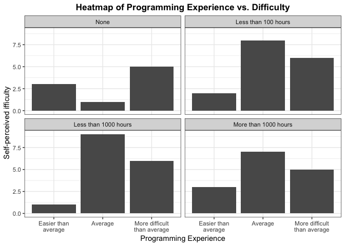

Milestone 3 - Report
================
Author: Patrick Tung, PAUL VIAL and Mengda (Albert) Yu
Date: 2019/04/22

-   [1.0 Introduction](#introduction)
-   [2.0 Data description](#data-description)
-   [3.0 Key EDA](#key-eda)
-   [4.0 Analysis](#analysis)
    -   [Method 1 - Ordinal Regression Test](#method-1---ordinal-regression-test)
    -   [Method 2 - Likelihood Ratio Test with Ordinal Logistic Regression](#method-2---likelihood-ratio-test-with-ordinal-logistic-regression)
-   [5.0 Discussion](#discussion)
    -   [5.1 Findings](#findings)
    -   [5.2 Survey design](#survey-design)

1.0 Introduction
================

As the Master of Data science program is soon to end, we all like to reflect on the courses we have taken. Some courses we took were difficult and some were relatively easier, but the true question is, how was this affected based on our prior experience. DSCI 512 is a programming and algorithms course in the MDS program at UBC which introduces fundamental algorithms such as sorting and searching, as well as data structures.This project is to analyze whether the level of programming experience prior to the MDS program affects an MDS student's self-perceived difficulty of DSCI 512 materials.

Question: Does their level of programming experience prior to the MDS program influence a person's self-perceived difficulty of DSCI 512 (Algorithms and Data Structures)?

We began with defining null hypothesis and alternative hypothesis, as shown below.

> Null hypothesis: The level of programming experience prior to the MDS program does not influence a person's self-perceived difficulty regarding DSCI 512.

> Alternative hypothesis: The level of programming experience prior to the MDS program influences a person's self-perceived difficulty regarding DSCI 512.

After extensive brainstorming, we decided that the variables we believe that are important are:

-   Previous programming experience
-   Sex
-   Mathematics skill level
-   Whether or not a student has friends or family with programming experience

2.0 Data description
====================

To gather the data, we created a survey and collected 56 observations from our fellow MDS students, 554 TAs and lab instructor for self-perceived difficulty of the DSCI 512 course.

<table style="width:33%;">
<colgroup>
<col width="8%" />
<col width="8%" />
<col width="8%" />
<col width="8%" />
</colgroup>
<thead>
<tr class="header">
<th align="center">Variable</th>
<th align="center">Name</th>
<th align="center">Type</th>
<th align="center">Description</th>
</tr>
</thead>
<tbody>
<tr class="odd">
<td align="center">Confounder</td>
<td align="center"><code>sex</code></td>
<td align="center">category</td>
<td align="center">Female or Male</td>
</tr>
<tr class="even">
<td align="center">Confounder</td>
<td align="center"><code>math_skill</code></td>
<td align="center">ordinal</td>
<td align="center">Self-reported Math skills (Below average, Average, Above average)</td>
</tr>
<tr class="odd">
<td align="center">Confounder</td>
<td align="center"><code>friend_with_prog</code></td>
<td align="center">category</td>
<td align="center">Friends who have jobs associated with programming (No, Yes)</td>
</tr>
<tr class="even">
<td align="center">Main Covariate</td>
<td align="center"><code>prog_exp</code></td>
<td align="center">ordinal</td>
<td align="center">Previous programming experience prior to the MDS in hour (None, Less than 100 hours, Less than 1000 hours, More than 1000 hours)</td>
</tr>
<tr class="odd">
<td align="center">Outcome</td>
<td align="center"><code>difficulty</code></td>
<td align="center">ordinal</td>
<td align="center">Self-perceived difficulty (Easier than average, Average, More difficult than average)</td>
</tr>
</tbody>
</table>

|                             |     Female|       Male|
|-----------------------------|----------:|----------:|
| Easier than average         |  0.1071429|  0.0535714|
| Average                     |  0.1428571|  0.3035714|
| More difficult than average |  0.1607143|  0.2321429|

|                             |  Below Average|    Average|  Above Average|
|-----------------------------|--------------:|----------:|--------------:|
| Easier than average         |      0.0178571|  0.0892857|      0.0535714|
| Average                     |      0.0178571|  0.0535714|      0.3750000|
| More difficult than average |      0.0178571|  0.1071429|      0.2678571|

|                             |        Yes|         No|
|-----------------------------|----------:|----------:|
| Easier than average         |  0.1071429|  0.0535714|
| Average                     |  0.3750000|  0.0714286|
| More difficult than average |  0.2321429|  0.1607143|

|                             |       None|  Less than 100 hours|  Less than 1000 hours|  More than 1000 hours|
|-----------------------------|----------:|--------------------:|---------------------:|---------------------:|
| Easier than average         |  0.0535714|            0.0357143|             0.0178571|             0.0535714|
| Average                     |  0.0178571|            0.1428571|             0.1607143|             0.1250000|
| More difficult than average |  0.0892857|            0.1071429|             0.1071429|             0.0892857|

3.0 Key EDA
===========

We firstly did some preliminary investigations to understand the data and discover important patterns.


*Figure 1.*

It can be seen that the number of students who have been experiencing a harder time in DSCI 512 is greater than the number of students who felt easier than average.



*Figure 2.*

For the group without no programming experience, more people felt difficult, which makes senes that if students have no programming experiences, they are more likely to strggule with assginments and tests. It is also interesting to note that the difficulty reported by the most of students is average in the rest three other groups (less than 100, less than 1000 hours, More than 1000 hours) and only a few students felt more difficult or less difficult than average.


*Figure 3.*

The self-reported difficulty that most of male students felt is average. The number of female students who felt the course easy is actually greater than the number of male student who had the similiar feeling.


*Figure 4.*

In this figure, we observe that the most of students who have proficiency in math felt that the difficulty of DSCI 512 is average. It seems like that the math skill does not affect the self-perceived difficulty.


*Figure 5.*

It is interesting to note that the students who have no friend with programming experience are more likely to feel more difficult with course materials. If a student has friends with programming experience, he/she tends to feel the difficulty of the course is average.

4.0 Analysis
============

To analyze our data, we implemented two different methods of testing: (1) Ordinal Regression Test and (2) Likelihood Ratio Test with Ordinal Regression.

Method 1 - Ordinal Regression Test
----------------------------------

We decided to apply ordinal regression to test whether the main exposure `prog_exp` has a significant impact on our outcome `difficulty`. The orginal regression is used to facilitate the interaction of dependent variables (having multiple ordered levels) with one or more independent variables.

``` r
m <- polr(difficulty~sex+math_skill+friend_with_prog+prog_exp, data=clean_data, Hess=TRUE)
summary(m)
```

    ## Call:
    ## polr(formula = difficulty ~ sex + math_skill + friend_with_prog + 
    ##     prog_exp, data = clean_data, Hess = TRUE)
    ## 
    ## Coefficients:
    ##                       Value Std. Error  t value
    ## sexMale             0.33583     0.5400  0.62193
    ## math_skill.L        0.62622     0.9149  0.68444
    ## math_skill.Q        0.09156     0.6922  0.13227
    ## friend_with_progNo  0.77943     0.6380  1.22174
    ## prog_exp.L         -0.06528     0.6548 -0.09970
    ## prog_exp.Q         -0.01389     0.5738 -0.02421
    ## prog_exp.C         -0.17604     0.4832 -0.36434
    ## 
    ## Intercepts:
    ##                                     Value   Std. Error t value
    ## Easier than average|Average         -1.0005  0.6295    -1.5895
    ## Average|More difficult than average  1.1835  0.6313     1.8747
    ## 
    ## Residual Deviance: 111.0194 
    ## AIC: 129.0194

SE, coef, t-value......

AIC -&gt; smaller -&gt; better

### 2. Calculate p-Value, CI, Odds ratio

``` r
# p-values
ctable <- coef(summary(m))
p <- pnorm(abs(ctable[, "t value"]), lower.tail = FALSE) * 2
ctable <- cbind(ctable, "p value" = p)
ctable
```

    ##                                           Value Std. Error     t value
    ## sexMale                              0.33582501  0.5399700  0.62193268
    ## math_skill.L                         0.62622193  0.9149343  0.68444470
    ## math_skill.Q                         0.09156132  0.6922167  0.13227262
    ## friend_with_progNo                   0.77942511  0.6379619  1.22174237
    ## prog_exp.L                          -0.06527670  0.6547511 -0.09969697
    ## prog_exp.Q                          -0.01388964  0.5738209 -0.02420552
    ## prog_exp.C                          -0.17604248  0.4831802 -0.36434128
    ## Easier than average|Average         -1.00050531  0.6294600 -1.58946612
    ## Average|More difficult than average  1.18349901  0.6313020  1.87469561
    ##                                        p value
    ## sexMale                             0.53398613
    ## math_skill.L                        0.49369440
    ## math_skill.Q                        0.89476866
    ## friend_with_progNo                  0.22180507
    ## prog_exp.L                          0.92058490
    ## prog_exp.Q                          0.98068867
    ## prog_exp.C                          0.71560318
    ## Easier than average|Average         0.11195520
    ## Average|More difficult than average 0.06083461

``` r
# CI
ci <- confint(m)
```

    ## Waiting for profiling to be done...

``` r
# OR and Ci
exp(cbind(OR = coef(m), ci))
```

    ##                           OR     2.5 %    97.5 %
    ## sexMale            1.3990942 0.4852977  4.084237
    ## math_skill.L       1.8705302 0.2940654 11.988024
    ## math_skill.Q       1.0958840 0.2766424  4.343515
    ## friend_with_progNo 2.1802185 0.6327100  7.925210
    ## prog_exp.L         0.9368082 0.2513450  3.372955
    ## prog_exp.Q         0.9862064 0.3193682  3.087021
    ## prog_exp.C         0.8385824 0.3221580  2.165894

``` r
Anova(m, type = 3)
```

    ## Analysis of Deviance Table (Type III tests)
    ## 
    ## Response: difficulty
    ##                  LR Chisq Df Pr(>Chisq)
    ## sex               0.38773  1     0.5335
    ## math_skill        1.09944  2     0.5771
    ## friend_with_prog  1.51981  1     0.2176
    ## prog_exp          0.14187  3     0.9864

Method 2 - Likelihood Ratio Test with Ordinal Logistic Regression
-----------------------------------------------------------------

In this case, because we are comparing the fit of multiple different models, we decided to adjust our p-values with the Bonferroni correction.

``` r
#Null model, no predictors
olr.M0 <- polr(difficulty~1, data=clean_data)   
```

``` r
#Full model
olr.M1 <- polr(difficulty~sex+math_skill+friend_with_prog+prog_exp, data=clean_data)
```

``` r
#Are all variables good predictors?
lrtest(olr.M1, olr.M0)
```

    ## Likelihood ratio test
    ## 
    ## Model 1: difficulty ~ sex + math_skill + friend_with_prog + prog_exp
    ## Model 2: difficulty ~ 1
    ##   #Df LogLik Df  Chisq Pr(>Chisq)
    ## 1   9 -55.51                     
    ## 2   2 -57.17 -7 3.3203     0.8539

``` r
# Reduced model, with our main variabel
olr.M2 <- polr(difficulty~prog_exp, data=clean_data)
```

5.0 Discussion
==============

5.1 Findings
------------

1.  Discussing the results and findings of your survey and analysis of the survey data.

5.2 Survey design
-----------------

Discussing your survey/study design, specifically:

1.  what did you do well to make this study as causal as possible?
2.  what was not done well and how did that effect your studies conclusions?

One of the biggest problems that we discovered after performing the analysis is that the amount of data we collected is simply not enough to make conclusive claims. Perhaps it would have been helpful if we decided to collect data from previous cohorts of the MDS program. It might also be better if we continued our research to allow future MDS cohorts to reflect and take the survey. Another issue of our survey is that the level of "self-reported" infomration is very subjective to different people. An "Average" difficulty might mean something different to two different students. Therefore, it is quite difficult to evaluate the results of our research.

1.  what would you do differently next time to improve your survey/study design and why?

Originally when we were designing our survey, we thought it was very logical to make our variables categorical and ordinal, even our response variable (i.e. self-perceived difficulty of DSCI 512). However, while we were performing analyses and tests with our data, we realized that because our variables were not numerical, we lost a lot of flexibility with our analysis. If, for example, our response variable was numerical, we could have performed more tests such as ANOVA. Furthermore, if we figured that numerical data does not really work with our analysis, we could have binned them to become categorical. We feel that only using categorical data really limited our ability to perform different analysis, and if we were to perform similar research in the future, this is definitely something we would change.

------------------------------------------------------------------------

-   Your target audience is other Data Scientists who are not familiar with your project.
-   Clearly introduce the survey topic and question you were interested in answering.
-   Link to your study's data and code in the methods section of your report.
-   Include effective visualizations and/or tables that help communicate your findings.
-   Your discussion should have 2 key focuses:

1.  Discussing the results and findings of your survey and analysis of the survey data.
2.  Discussing your survey/study design, specifically:
    -   what did you do well to make this study as causal as possible?
    -   what was not done well and how did that effect your studies conclusions?
    -   what would you do differently next time to improve your survey/study design and why?
